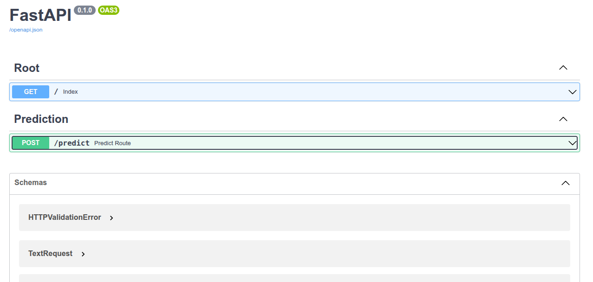

# End-to-End Text Summarization NLP

An end-to-end NLP project for abstractive text summarization using Hugging Face Transformers and FastAPI.

---

# Project Overview

This project focuses on building a complete text summarization system capable of generating concise summaries from long conversational or textual inputs using transformer-based deep learning models.

The project follows a modular machine learning pipeline architecture that includes:

- Data Ingestion
- Data Validation
- Data Transformation
- Model Training
- Model Evaluation
- Prediction Pipeline
- API Deployment

The application exposes the summarization model through a FastAPI REST API and supports local deployment using Docker and FastAPI.

---

# Model Used

## DistilBART

The project uses **DistilBART**, a lightweight distilled version of Facebook BART optimized for sequence-to-sequence NLP tasks such as summarization.

### Key Advantages

- Faster inference compared to larger transformer models
- Lower memory consumption
- Efficient for deployment environments
- Strong summarization performance
- Suitable for real-time API applications

DistilBART combines the power of transformer-based language understanding with reduced computational requirements.

---

# Dataset

## SAMSum Dataset

The model was trained using the **SAMSum** dataset, which is specifically designed for conversational text summarization.

### Dataset Characteristics

- Human-written dialogue summaries
- Multi-speaker conversations
- Informal conversational language
- Realistic messaging/chat scenarios

The dataset helps the model learn how to summarize dialogue-based interactions into concise summaries.

---

# Machine Learning Pipeline

## 1. Data Ingestion

Loads and stores the dataset locally inside the project artifacts directory.

---

## 2. Data Validation

Validates dataset integrity, file structure, and required data components.

---

## 3. Data Transformation

Performs tokenization and preprocessing using Hugging Face tokenizers.

This stage converts raw text into:

- input_ids
- attention_mask
- labels

---

## 4. Model Training

Fine-tunes the DistilBART model using the Hugging Face Trainer API.

Training includes:

- batching
- optimization
- gradient accumulation
- validation evaluation

---

## 5. Model Evaluation

Evaluates summarization quality using ROUGE metrics.

Metrics used:

- ROUGE-1
- ROUGE-2
- ROUGE-L
- ROUGE-Lsum

---

## 6. Prediction Pipeline

Loads the trained model and generates summaries for user input text.

---

# FastAPI Deployment

The project exposes the summarization model through a REST API built with FastAPI.

## Available Endpoint

### POST `/predict`

Accepts input text and returns a generated summary.

---

# API Preview

```md

```

---

# Cloud Deployment Experiment

The project was experimentally deployed using Docker and AWS cloud infrastructure as part of the deployment workflow exploration process.

Deployment experiments included:

- Docker containerization
- Amazon EC2 deployment
- Amazon ECR image storage
- GitHub Actions CI/CD integration

The deployment configuration and cloud resources were later removed to avoid unnecessary infrastructure costs.

---

# Running the Project Locally

## 1. Clone the Repository

```bash
git clone https://github.com/your-username/End-to-End-Text-Summarizer-NLP.git
```

---

## 2. Create Virtual Environment

```bash
python -m venv venv
```

---

## 3. Activate Environment

### Linux / macOS

```bash
source venv/bin/activate
```

### Windows

```bash
venv\Scripts\activate
```

---

## 4. Install Dependencies

```bash
pip install -r requirements.txt
```

---

## 5. Run the Training Pipeline

```bash
python main.py
```

This will automatically create the required `artifacts/` directory and generate:

- processed datasets
- trained model files
- tokenizer files
- evaluation outputs

---

## 6. Run the FastAPI Application

```bash
python app.py
```

---

## 7. Open Swagger UI

```text
http://localhost:8080/docs
```

---

# GPU Recommendation

Training transformer-based summarization models on CPU can be very slow.

Using a CUDA-enabled GPU is highly recommended for faster training and inference.

The project currently uses CPU inference by default:

```python
device = -1
```

To enable GPU inference, update the device configuration inside the prediction pipeline:

```python
device = 0
```

# Example API Request

```json
{
  "text": "Ali: Hey everyone, just a reminder that the product demo is tomorrow morning at 10 AM. We still need to finalize a few things before presenting to the client.\n\nSara: I finished the UI updates last night and pushed the latest version to the repository. The dashboard layout is now responsive on both desktop and tablet devices.\n\nOmar: Great. I reviewed the API integration this morning. Most endpoints are working correctly, but there is still an issue with the authentication token expiring too early.\n\nLina: I can take a look at the authentication service after lunch. I think the token refresh interval is configured incorrectly in the backend settings.\n\nAli: Perfect. Also, the client specifically requested that we improve the loading performance for the analytics page because it was too slow during the previous demo.\n\nSara: I already optimized some of the frontend rendering logic. The charts are loading much faster now, but we still need backend caching to fully solve the issue.\n\nOmar: I can implement Redis caching tonight if needed. That should significantly reduce the response time for repeated requests.\n\nLina: Sounds good. I’ll help test the caching implementation once it’s done. We should also monitor memory usage to make sure the server remains stable.\n\nAli: Another thing, the client wants an export-to-PDF feature for reports. We probably won’t finish the full implementation before tomorrow, but maybe we can prepare a prototype version.\n\nSara: I can quickly design a basic export layout this evening. Even if it’s not production-ready, it will help demonstrate the idea during the meeting.\n\nOmar: By the way, I updated the Docker deployment pipeline yesterday. The application can now be deployed automatically using GitHub Actions and AWS EC2.\n\nLina: Nice. Did you also configure the ECR image storage?\n\nOmar: Yes, the Docker image is automatically pushed to Amazon ECR after every successful build.\n\nAli: That’s excellent. Automated deployment will definitely make maintenance easier in the future.\n\nSara: I think we should also prepare backup slides in case the live demo fails during the presentation.\n\nAli: Agreed. Let’s prepare screenshots and short video clips as backup material.\n\nLina: I’ll also prepare a short technical architecture diagram explaining the system components, API flow, and cloud deployment setup.\n\nOmar: Perfect. Once I finish the Redis setup tonight, I’ll send everyone the updated deployment logs and benchmark results.\n\nAli: Thanks everyone. Let’s do one final rehearsal tomorrow at 8:30 AM before the client joins."
}
```

---

# Example API Response

```json
{
  "summary": "The product demo is tomorrow morning at 10 AM. Ali, Sara, Omar, Lina and Lina are going to present their product to the client. The client wants an export-to-PDF feature for reports. Omar updated the Docker pipeline and the application can be deployed automatically using GitHub Actions and AWS EC2."
}
```

---

# Future Improvements

- Add model monitoring
- Improve inference optimization
- Add authentication and rate limiting
- Support larger summarization models
- Add Kubernetes deployment support

---

# License

This project is licensed under the MIT License.